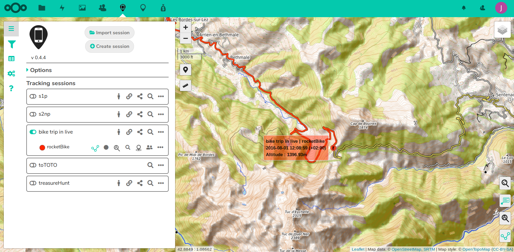
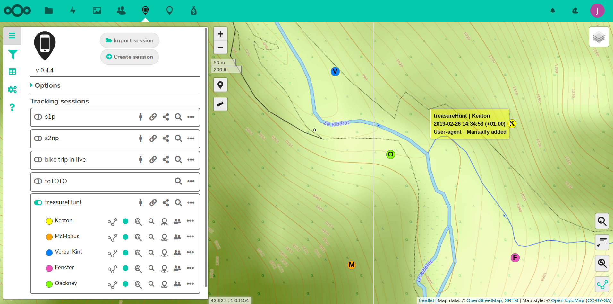
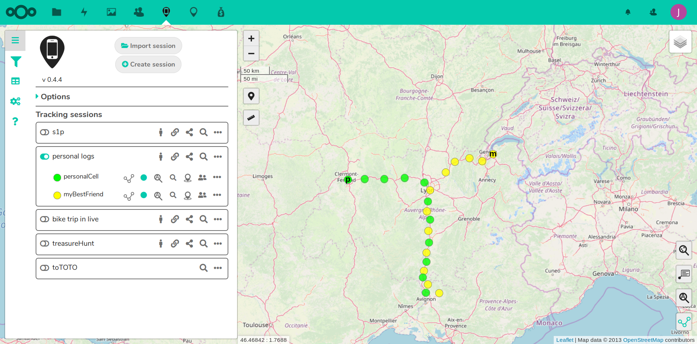

[[_TOC_]]

# PhoneTrack documentation

* [User documentation](userdoc)
* [Admin documentation](admindoc) (installation and configuration instructions)
* [Developer documentation](devdoc) (overall app functioning, javascript interface description)

# Releases (for Nextcloud)

* [phonetrack-0.4.0.tar.gz](uploads/aa2bc2061b8451285f3c3d826af1c74f/phonetrack-0.4.0.tar.gz)
* [phonetrack-0.4.1.tar.gz](uploads/32a212f0de69a1fd5b8e69ddc119e992/phonetrack-0.4.1.tar.gz)
* [phonetrack-0.4.2.tar.gz](uploads/5ee7133519ad6e7991451fc59c81180f/phonetrack-0.4.2.tar.gz)
* [phonetrack-0.4.3.tar.gz](uploads/1a92460aafca3ba253bc51cc7a52737e/phonetrack-0.4.3.tar.gz)

## Old releases

* [phonetrack-0.3.1.tar.gz](/uploads/dfa59ece49312f190b205a52ba4dc63a/phonetrack-0.3.1.tar.gz)
* [phonetrack-0.3.4.tar.gz](uploads/564b129ce83b83603bb0476206f92f4b/phonetrack-0.3.4.tar.gz)
* [phonetrack-0.3.5.tar.gz](uploads/e698bf1c2b6f6230e0fdd54b0575e1ac/phonetrack-0.3.5.tar.gz)
* [phonetrack-0.3.6.tar.gz](uploads/b8fb76a345ed8ba65638e65890bfb45e/phonetrack-0.3.6.tar.gz)
* [phonetrack-0.3.8.tar.gz](uploads/6339c14cdaa30ade57e352725d795c9d/phonetrack-0.3.8.tar.gz)
* [phonetrack-0.3.9.tar.gz](uploads/101620a04505ae1b38954a4cb364e68d/phonetrack-0.3.9.tar.gz)

# Donation

I develop this app during my free time.

* [Donate on Paypal](https://www.paypal.com/cgi-bin/webscr?cmd=_s-xclick&hosted_button_id=66PALMY8SF5JE) (you don't need a paypal account)
* [Donate with Liberapay : ](https://liberapay.com/eneiluj/donate)

# Screenshots

## Two devices displayed

## Editing a point

## Public page displaying other devices and tracking browser's device

